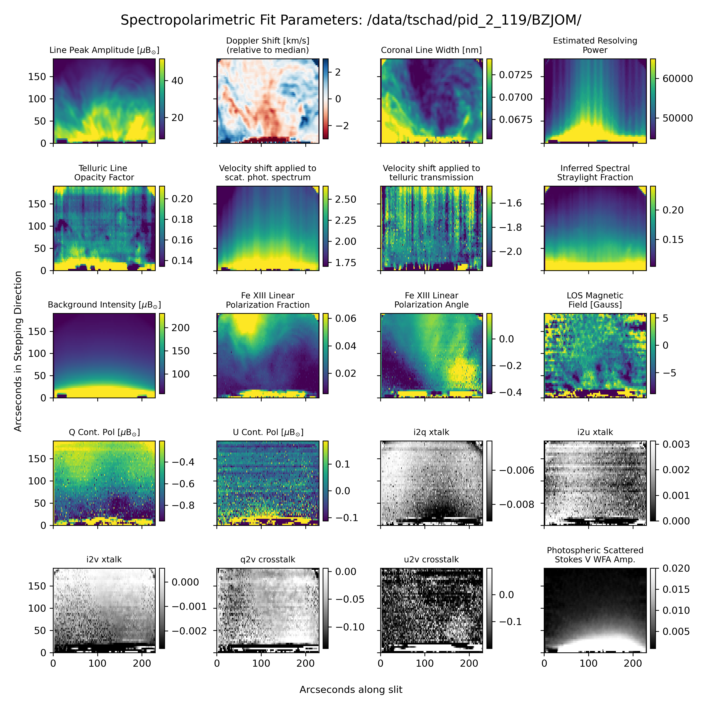

## CryoNIRSP First Data Release: Tutorial for Spectrapolarimetric Line Fitting

Tom Schad | NSO | DKIST 

This is a subdirectory of the cryonirsp-notebooks repository, which is a collection of useful notebooks that demonstrate some CryoNIRSP analysis tasks in notebook tutorial form.  This tutorial was created at the time of the first CryoNIRSP Level 1 data release (9 September 2024).  It shows, for one spectropolarimetric raster at 1074 nm, how to perform line fitting both spectroscopically and polarimetrically.  For the polarimetry, corrections for crosstalk between Stokes states is taken into account. 

### Example Stokes I Line Fitting 

### Example Maps of Polarimetric Fit Parameters

